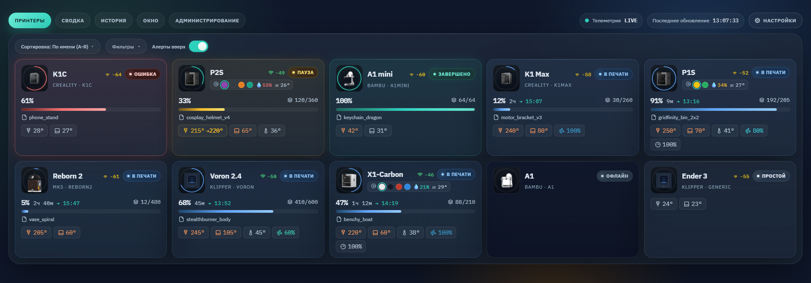
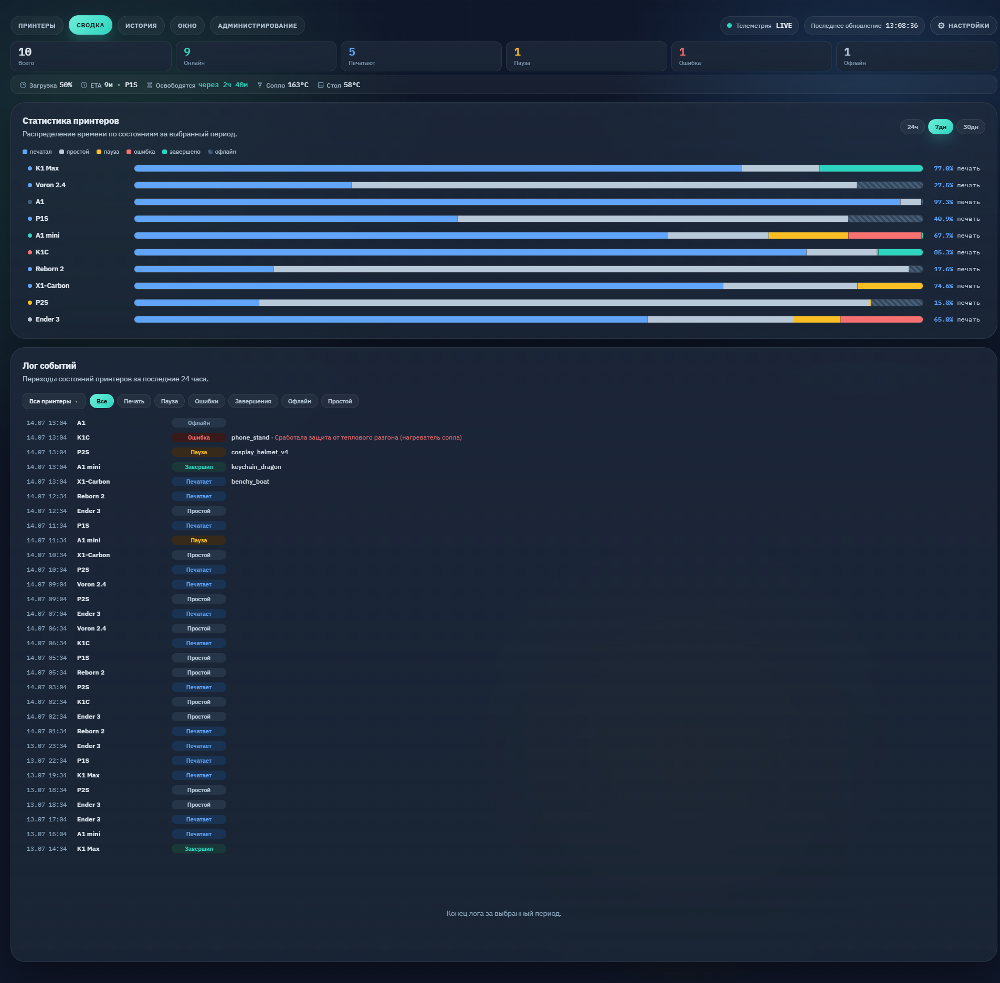

# Kuznitsa — Self-Hosted 3D-Printer Farm Dashboard

A lightweight, self-hosted dashboard for monitoring and controlling a mixed fleet
of 3D printers from one web page. Built for print farms that run more than one
brand of machine and want a single, always-on status board with history,
notifications, and basic remote control.

Supports **Bambu Lab**, **Creality** (K1 series / Sonic Pad), **Klipper /
Moonraker**, and **MKS WiFi** printers side by side.



*Live board — every printer on one page: state, progress, ETA, nozzle/bed/chamber
temperatures, AMS slots, and Wi-Fi signal. (Screenshot uses a synthetic demo fleet.)*



*Summary view — fleet load, aggregate metrics, and per-printer state-duration analytics.*

## Features

- **Unified live board** — every printer on one page: state, progress, ETA,
  nozzle/bed/chamber temperatures, current job, Wi-Fi signal, AMS status.
- **Multi-protocol** — Bambu (MQTT), Creality and Klipper/Moonraker (WebSocket),
  and MKS WiFi, polled concurrently.
- **History & analytics** — per-printer state timeline and state-duration
  summaries backed by SQLite.
- **Telegram notifications** — configurable alerts on finish / pause / error,
  with an optional outbound proxy pool, all editable from the UI.
- **Remote control** — pause/resume/stop and temperature control for supported
  models (capability-probed per firmware).
- **Auth & roles** — JWT cookie sessions, `admin` and `viewer` roles, login rate
  limiting, refresh-token rotation, and an audit log.
- **Fleet managed from the UI** — add, edit, and remove printers in the admin
  panel; no code edits or redeploys to change the fleet.

## Tech stack

- **Backend:** Python 3 + [FastAPI](https://fastapi.tiangolo.com/) / Uvicorn
- **Frontend:** vanilla JavaScript, HTML, and CSS (no build step)
- **Storage:** SQLite (`printer_history.db` for fleet/settings/history,
  `users.db` for accounts/audit)
- **Printer libraries:** `pybambu` (Bambu), `websocket-client` (Creality /
  Klipper), plus a small MKS WiFi client
- **Bot:** `aiogram` for Telegram

## Requirements

- **Host:** Linux, macOS, or Windows with Python 3.11+ (or just Docker).
- **Network:** the host must be able to reach each printer over your LAN.
  Printers are polled directly — Bambu over MQTT (TLS 8883), Creality and
  Klipper/Moonraker over WebSocket, MKS over its WiFi HTTP/TCP port. Put the
  host and the printers on the same subnet/VLAN (or route/firewall between
  them accordingly). No cloud account is used.
- **Per printer:** for Bambu you need the machine's **access code** and
  **serial**, and the printer in **LAN Mode**. Creality/Klipper/MKS just need
  the host/IP.

## Quick start

### Docker (recommended)

```bash
git clone <your-fork-url> kuznitsa && cd kuznitsa
touch printer_history.db users.db      # so Docker mounts them as files
docker compose up -d --build
docker compose logs -f                 # read the first-run admin password once
```

Open `http://<host>:8000` and log in as `admin`. Databases persist in the repo
directory; `docker compose pull`/`up --build` picks up new versions.

### From source

```bash
git clone <your-fork-url> kuznitsa
cd kuznitsa

python -m venv .venv
. .venv/bin/activate            # Windows: .venv\Scripts\activate
pip install -r requirements.txt

cp .env.example .env            # optional — see below
python main.py
```

Then open the dashboard (default `http://127.0.0.1:8000`).

### First-run admin

On first boot, with no users in the database, an `admin` account is created:

- If you set `FORGE_ADMIN_USERNAME` / `FORGE_ADMIN_PASSWORD`, those are used.
- Otherwise a **random password is generated and printed once to the log** —
  read it there, log in, and change it immediately from the UI.

### Adding printers

Log in as admin, open **Admin → Printers**, and add each machine (kind, label,
host; for Bambu also the access code and serial). Changes are stored in the
database; click **Apply** to restart the poller onto the new fleet. Nothing about
your fleet lives in the source tree.

### Configuration

All runtime configuration is optional and has safe defaults. See
[`.env.example`](./.env.example) for the full list. Highlights:

| Variable | Default | Purpose |
| --- | --- | --- |
| `FORGE_JWT_SECRET` | auto-generated & persisted | JWT signing key |
| `FORGE_ADMIN_USERNAME` | `admin` | First-run admin username |
| `FORGE_ADMIN_PASSWORD` | random (logged once) | First-run admin password |
| `COOKIE_SECURE` | `1` | Send auth cookies over HTTPS only |
| `WEB_HOST` / `WEB_PORT` | `127.0.0.1` / `8000` | Server bind address |
| `POLL_INTERVAL` / `MAX_WORKERS` | `5` / `10` | Polling cadence / concurrency |

The **Telegram bot token, chat id, notification templates, and proxy list** are
managed in the database and edited from **Settings** in the UI — not via env or
code.

Run behind a TLS reverse proxy (e.g. nginx) in production and keep
`COOKIE_SECURE=1`. Serve the app with a process manager such as a systemd
unit; bind it to `127.0.0.1` and let the proxy terminate TLS.

Ready-to-adapt examples (placeholders, no real hosts) live in
[`deploy/`](./deploy/): a systemd unit (`bambudiagnostic.service`) with an
installer (`install_service.sh`), an nginx TLS vhost (`nginx-bambu.conf`), a
self-signed HTTPS bootstrap (`setup_https.sh`), and an optional SSH
reverse-tunnel unit for exposing a LAN instance through a public VPS.

## Running the tests

```bash
pip install pytest
python -m pytest -q
```

## Русский (кратко)

Самостоятельно размещаемая панель мониторинга фермы 3D-принтеров: Bambu Lab,
Creality, Klipper/Moonraker и MKS WiFi на одной странице — состояние, прогресс,
температуры, история, уведомления в Telegram и базовое управление. Парк
принтеров, токен Telegram и прокси задаются в веб-интерфейсе (хранятся в БД), а
не в коде. Быстрый старт и переменные окружения — см. разделы выше и
[`.env.example`](./.env.example).

## License

This project is dual-licensed:

- **Open source:** [GNU AGPL-3.0](./LICENSE). Network use triggers the
  source-disclosure obligation — if you host a modified version, share your
  source.
- **Commercial:** a separate license is available for closed-source / SaaS use —
  see [`COMMERCIAL-LICENSE.md`](./COMMERCIAL-LICENSE.md).

Contributions are accepted under the CLA in [`CONTRIBUTING.md`](./CONTRIBUTING.md).
